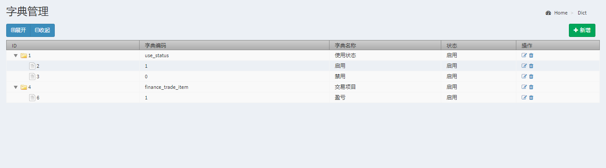

Tree-table for laravel-admin 
======

## ScreenShot


## Install

```bash
composer require laravel-admin-ext/tree-table
php artisan vendor:publish --provider=Encore\TreeTable\TreeTableServiceProvider
```

## Update

```bash
composer require laravel-admin-ext/tree-table
php artisan vendor:publish --tag=tree-table --force
```

## Configurations

Add `extensions` option in your `config/admin.php` configuration file:

```php
'extensions' => [
    'data-table' => [
        // If the value is set to false, this extension will be disabled
        'enable' => true,
        // global options
        'options' => [
             'paging' => false,
             'lengthChange' => false,
             'searching' => false,
             'ordering' => false,
             'info' => false,
             //'language' => 'English', // or Chinese //因没有语言包，这个可不要
        ]
    ]
]
```

## Use

```php
use Encore\TreeTable\TreeTable;

// table
$urls = ['create'=>'dict/create'];
$headers = [['field'=>'id','title'=>'ID'],['field'=>'code','title'=>'字典编码'],['field'=>'name_cn','title'=>'字典名称'],['field'=>'status','title'=>'状态'],['field'=>'operate','title'=>'操作']];

$dictList = Dict::with('allChildrenDicts')->paginate();//从数据库获取数据

$columns = ['id', 'code', 'name_cn', 'status', 'operate'];
        $style = ['table-bordered','table-hover', 'table-striped'];
        $options = [
            'paging' => true,
            'lengthChange' => false,
            'searching' => false,
            'ordering' => true,
            'info' => true,
            'autoWidth' => false,
        ];
$formats = ['status'=>['0'=>'禁用','1'=>'启用']];
$operates = [['cls'=>'edit', 'url'=>'dict/%s/edit'], ['cls'=>'trash', 'url'=>'dict/%s/delete']];

$treeTable = new TreeTable($urls, $headers, $columns, $dictList->items(), $style, $options, $formats, $operates);

return $content->header('字典管理')
            ->body($treeTable->render());
```


## More resources

[Laravel-admin-tree-table](https://github.com/5202m/laravel-tree-table)

## License